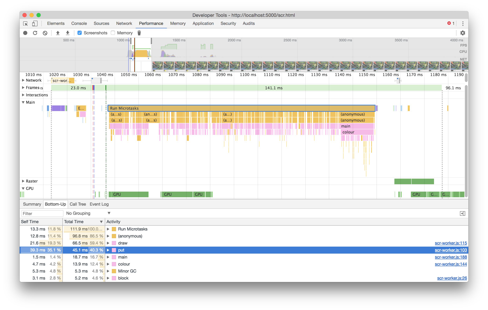
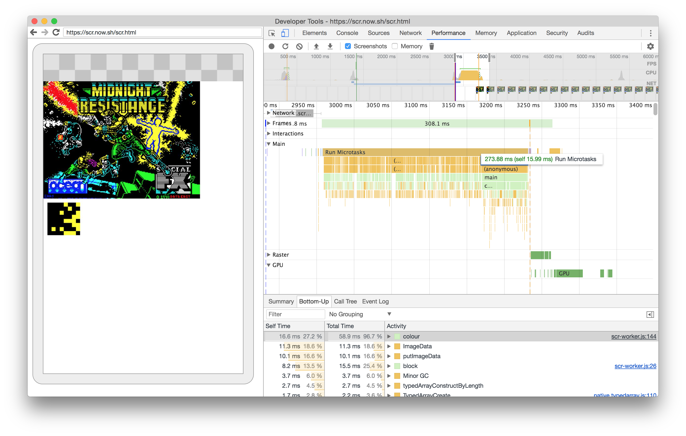
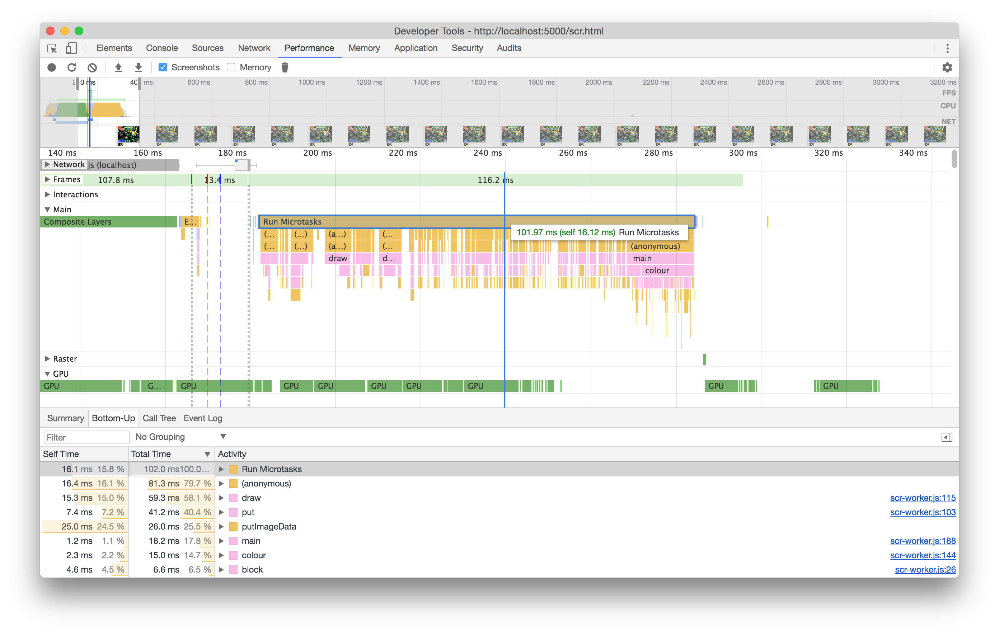
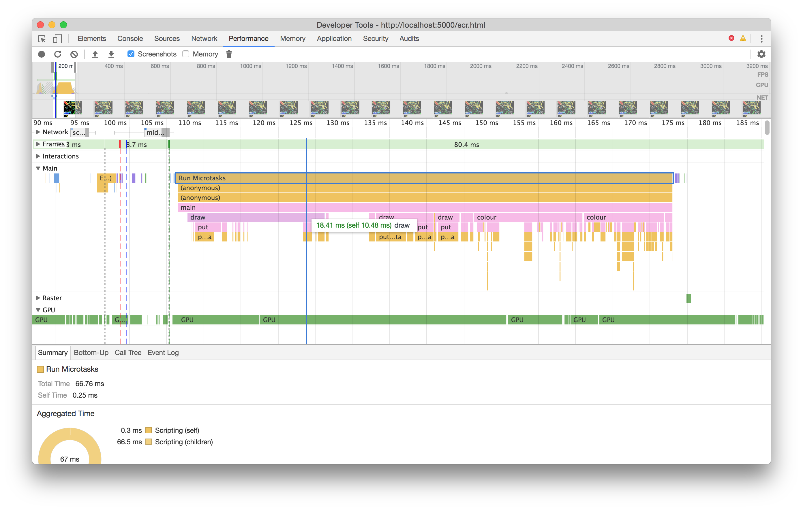
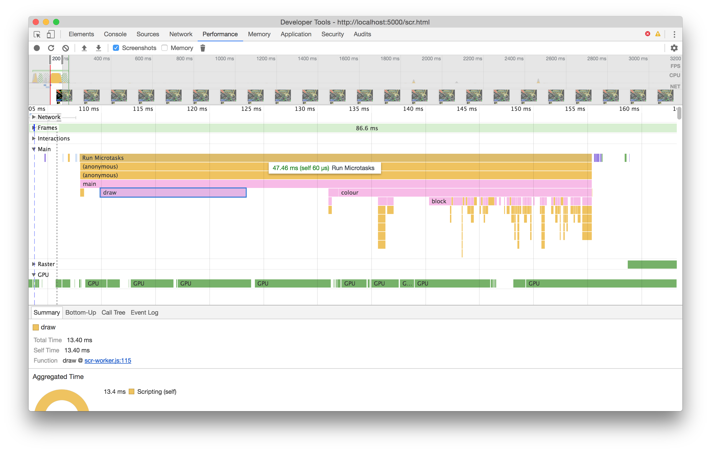

# Optimising SCREEN loader

Currently the scr.js loads old ZX Spectrum .SCR SCREEN dumps. These are well documented and in a reasonably simple binary format. The current code runs in a single thread, has been refactored a number of times, but only with readability and simplicity in mind, rather than performance.

The current run time for the JavaScript (on a high end MBP with a lot of memory) is ~140ms. On a Google Pixel XL it's about twice at ~300ms.





## Plan

The idea is to see if I can make the loading time much faster. I'm not working with a great deal of time in the first instance, and there's no significant bottlenecks, but I want to see if I can *at least* half these times.

The first pass will be to optimise specific areas of the code, batching operations where possible and reusing variables. I'll start by running a performance profile with the scr.js open so I can look at individual line timings, and work from there.

The second pass will be to use web workers with `SharedArrayBuffer` as the screen rendering is split into thirds (and so is the scr.js drawing process), so I should be able to run this processing in parallel and squeeze my load time.

## Optimising draw routine

Looking at the performance profile shows that the there's a consistently larger call to `draw` (although only around 2-5ms). It's hard to tell much more from the profiling at this higher level, but the function is small enough to eye-ball.

```js
async function draw(ctx, third, data) {
  const imageData = new Uint8ClampedArray(4 * 8);
  let ctr = 0;
  for (let offset = 0; offset < 8; offset++) {
    for (let line = 0; line < 8; line++) {
      for (let i = 0; i < 32; i++) {
        let j = 0;
        const ptr = ctr++;
        const byte = data[ptr];

        // imageData rgba 8x1
        for (; j < 8; j++) {
          // determines bit for i, based on MSb
          const bit = (byte & (1 << (7 - j))) === 0 ? 0 : 255;

          const offset = j * 4;
          imageData[offset + 0] = bit;
          imageData[offset + 1] = bit;
          imageData[offset + 2] = bit;
          imageData[offset + 3] = 255;
        }
        const x = i * 8;
        const y = ctx.canvas.height / 3 * third + line * 8 + offset;
        await put(ctx, new ImageData(imageData, 8, 1), x, y);
      }
    }
  }
}
```

As JavaScript goes, anything that's "pure primitive JavaScript" (my term), i.e. maths, object lookups, built-in loops, etc - isn't worth starting with. However, any place I'm creating `new` objects is worth looking at optimising. In particular `await put(ctx, new ImageData(imageData, 8, 1), x, y)`.

This image data can be created up front (in the loading of the funtion) and re-used. The change has a positive impact, and reduces load time down to ~100ms.



The original version of the code used a delay of 1ms between putting the pixels on to the screen to creating a progressive loading effect to replicate the retro feel of a ZX Spectrum, but here I want to go as fast as possible, and I can remove the `await` in the `put` calls (and the related `draw` function calls).

The net effect of removing the async/await is to strip another 40ms off the load time. At this point, it's getting into micro optimisations which I'm only chasing in the interest of understanding the impact of the tweak:



Why did removing async/await strip milliseconds off the timing? Bear in mind it really only reduced the timing by 40ms - which relative to _this_ project is a chunk, but to most projects, won't be much at all. I believe (and I'll update when I'm proved to be wrong!), it's because of the additional function calls (going by the performance report there's an anonymous function that's part of the async/await process), and likely the internal handling of async/await inside of V8 (Chrome's JavaScript engine) which now doesn't need to be used.

---

Again, due to the original rendering method, the way the image data is generated, is eight pixels at a time. An obvious change: let's build the entire image data array at once, and `putImageData` just the one time.

Obviously that has an impact, thought in my recordings, it ranged from reducing a further 20ms off, to 5 ms - down to 45ms and 60ms respectively. That's to say, again: this is a micro optimisation. In my particular case, it's because the bulk of the function is loops and bit shifting, whereas the `ctx.putImageData` is actually pretty quick. Still, it did make an impact:



The `draw` function now looks like this:

```js
function draw(ctx, third, data) {
  const width = 32 * 8;
  const height = 24 / 3 * 8;
  const imageData = new ImageData(new Uint8ClampedArray(4 * width * height), width, height);
  let ctr = 0;
  for (let offset = 0; offset < 8; offset++) {
    for (let line = 0; line < 8; line++) {
      for (let i = 0; i < 32; i++) {
        let j = 0;
        const ptr = ctr++;
        const byte = data[ptr];

        const x = i * 8;
        const y = ctx.canvas.height / 3 * third + line * 8 + offset;

        // imageData rgba 8x1
        for (; j < 8; j++) {
          // determines bit for i, based on MSb
          const bit = (byte & (1 << (7 - j))) === 0 ? 0 : 255;

          const ptr = x + 256 * i + y * 32;
          const offset = ptr + j * 4;
          imageData.data[offset + 0] = bit;
          imageData.data[offset + 1] = bit;
          imageData.data[offset + 2] = bit;
          imageData.data[offset + 3] = 255;
        }
      }
    }
  }
  put(ctx, imageData, 0, ctx.canvas.height / 3 * third);
}
```

## Optimising colour routine

The `colour` routine, like the `draw` routine, is fairly small and should be, in theory, an eye-ball optimisation candidate:

```js
function colour(ctx, buffer) {
  const attribs = buffer.subarray(2048 * 3);

  for (let i = 0; i < attribs.length; i++) {
    const attribute = attribs[i];
    const { ink, paper, blink } = readAttributes(attribute);

    const x = i % (ctx.canvas.width / 8);
    const y = (i / (ctx.canvas.width / 8)) | 0;

    // this line makes the actual coloured 8x8 pixels
    const pixel = new ImageData(block(x, y, buffer), 8, 8);

    if (blink && ink.join('') !== paper.join('')) {
      toBlink.push({
        attribute,
        x,
        y,
      });
    }

    put(ctx, pixel, x * 8, y * 8); // replace the 8x8 "pixel"
  }
}
```

The first thing I tried was to remove the repeated `new` call, as I did in the `draw` routine, but since `imageData.data` is a read only property, I can't just set the value, I need to use `.set` method on the typed array, so that when the "pixel" is created, it's copied across to the single use image data:

```js
// this line makes the actual coloured 8x8 pixels
imageData.data.set(block(x, y, buffer));
```

This shaves a tiny (almost insignificant) amount, about ~5ms.
